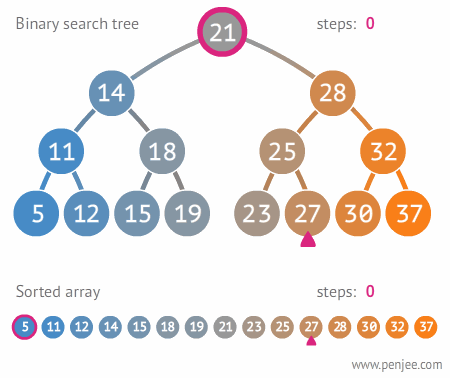

# BinaryTrees
A ***tree data structure*** is a hierarchical [nonlinear](https://www.geeksforgeeks.org/difference-between-linear-and-non-linear-data-structures/) structure that is used to represent and organize data in a way that is easy to navigate and search. It is a collection of nodes that are connected by edges and has a hierarchical relationship between the nodes.
## Contents 
- [Important terminologies](#important-terminologies)
- [Types of trees](#Types-of-trees)
- [Heights of a Binary Tree](#Heights-of-a-Binary-Tree)
- [The ADT Binary Tree implementations](#The-ADT-Binary-Tree-implementations)
- [Useful videos](#Useful-videos)
- [Useful articles](#Useful-articles)
- [For practice](#For-practice)
- 

## Important terminologies 
- ***Parent Node:*** The node which is a predecessor of a node is called the parent node of that node. 
- ***Child Node:*** The node which is the immediate successor of a node is called the child node of that node. 
- ***Root Node:*** The topmost node of a tree or the node which does not have any parent node is called the root node.
> A non-empty tree must contain exactly one root node and exactly one path from the root to all other nodes of the tree.
- **Leaf Node or External Node:** The nodes which do not have any child nodes are called leaf nodes. 
- **Ancestor of a Node:*** Any predecessor nodes on the path of the root to that node are called Ancestors of that node. 
- ***Descendant:*** A node x is a descendant of another node y if and only if y is an ancestor of x.
- ***Sibling:*** Children of the same parent node are called siblings. 
- ***Level of a node:*** The count of edges on the path from the root node to that node. The root node has level 0.
- ***Internal node:*** A node with at least one child is called Internal Node.
- ***Neighbour of a Node:*** Parent or child nodes of that node are called neighbors of that node.
- ***Subtree***: Any node of the tree along with its descendant.

----
## Types of Trees
#### Position oriented :
- [Generic Trees (N-ary Tree)](#Generic-Trees)
- [Binary Trees](#Binary-Trees)
#### Value oriented :
- [Binary Search Tree BST](#BST)
- [AVL Trees](#AVL-Trees)

----
## Generic Trees
Generic trees are a collection of nodes where each node is a data structure that consists of records and a list of references to its children(duplicate references are not allowed). Unlike the linked list, each node stores the address of multiple nodes. Every node stores address of its children and the very first node’s address will be stored in a separate pointer called root.

The Generic trees are the N-ary trees which have the following properties: 

 1) Many children at every node.</br>
2) The number of nodes for each node is not known in advance.<br>
[For more info](https://www.geeksforgeeks.org/generic-treesn-array-trees/)

## Binary Trees
 A binary Tree is defined as a Tree data structure with at most 2 children. Since each element in a binary tree can have only 2 children, we typically name them the left and right child.
 Types of BTs: </br>
 - Full BT (based on number of nodes) </br>


 all nodes that are at a level less than h have two children each. </br>
 
 - Complete BT (based on levels completion) </br>


 A complete binary tree of height h is a binary tree that is full down to level h – 1, with level h filled in from left to right. </br>
 
 - Balanced BT (based on levels completion) </br>
 </br>
 A binary tree is height balanced, or simply balanced, if the height of any node’s right sub-tree differs from the height of the node’s left subtree by no more than 1.
-------
## Heights of a Binary Tree
*for a BT with n nodes*
- Max height :
```math
h = n
```
- min height --> Fill each level of tree as completely as possible 
```math
h = ceil (log_2(n + 1) )
```
 *for a BT with height h*
 - max number of nodes : 
 ```math
n = 2^{h} - 1
```
- min number of nodes : 
```math
n = h
```

----
## The ADT Binary Tree implementations 
- [Binary Node class](#BinaryNode)
- [BinaryTreeInterface class](#BinaryTreeInterface)
- [BinaryNodeTree ](#BinaryNodeTree)
### BinaryNode

```cpp
template <typename T>
class BinaryNode
{
private:
	T item; // Data portion
	BinaryNode<T>* leftChildPtr; // Pointer to left child
	BinaryNode<T>* rightChildPtr; // Pointer to right child
public:
	BinaryNode();
	BinaryNode(const T& anItem, BinaryNode<T>* leftPtr = nullptr, BinaryNode<T>* rightPtr = nullptr);
	void setItem(const T& anItem);
	T getItem() const;
	bool isLeaf() const;
	BinaryNode<T>* getLeftChildPtr() const;
	BinaryNode<T>* getRightChildPtr() const;
	void setLeftChildPtr(BinaryNode<T>* leftPtr);
	void setRightChildPtr(BinaryNode<T>* rightPtr);
};

```

### BinaryTreeInterface

```cpp
#include "BinaryNode.h"

template <typename T>
class BinaryTreeInterface
{
public:
	/** Tests whether this binary tree is empty.
	@return True if the binary tree is empty, or false if not. */
	virtual bool isEmpty() const = 0;
	/** Gets the height of this binary tree.
	@return The height of the binary tree. */
	virtual int getHeight() const = 0;
	/** Gets the number of nodes in this binary tree.
	@return The number of nodes in the binary tree. */
	virtual int getNumberOfNodes() const = 0;
	/** Gets the data that is in the root of this binary tree.
	@pre The binary tree is not empty.
	@post The root’s data has been returned, and the binary tree is unchanged.
	@return The data in the root of the binary tree. */
	virtual T getRootData() const = 0;
	/** Replaces the data item in the root of this binary tree
	with the given data, if the tree is not empty. However, if the tree is empty, 
	inserts a new root node containing the given data into the tree. 
	@pre None.
	@post The data in the root of the binary tree is as given.
	@param newData The data for the root. */
	virtual void setRootData(const T& newData) = 0;
	/** Adds a new node containing the given data to this binary tree.
	@param newData The data for the new node.
	@post The binary tree contains a new node.
	@return True if the addition is successful, or false not. **/
		virtual bool add(const T & newData) = 0;
	/** Removes the node containing the given data item from this binary tree.
	@param data The data value to remove from the binary tree.
	@return True if the removal is successful, or false not. */
		virtual bool remove(const T & data) = 0;
	/** Removes all nodes from this binary tree.*/
	virtual void clear() = 0;
	/** Gets a specific entry in this binary tree.
	@post The desired entry has been returned, and the binary tree
	is unchanged. If no such entry was found, an exception is thrown.
	@param anEntry The entry to locate.
	@return The entry in the binary tree that matches the given entry.
	@throw NotFoundException if the given entry is not in the tree. */
	virtual T getEntry(const T& anEntry) const throw(NotFoundException) = 0;
	/** Tests whether a given entry occurs in this binary tree.
	@post The binary search tree is unchanged.
	@param anEntry The entry to find.
	@return True if the entry occurs in the tree, or false if not. */
	virtual bool contains(const T& anEntry) const = 0;
	/** Traverses this binary tree in preorder (inorder, postorder) and
	calls the function visit once for each node.
	@param visit A client-defined function that performs an operation on
	or with the data in each visited node. */
	virtual void preorderTraverse(void visit(T&)) const = 0;
	virtual void inorderTraverse(void visit(T&)) const = 0;
	virtual void postorderTraverse(void visit(T&)) const = 0;
};
```
### BinaryNodeTree 
- Functions implemented:
	- [constructors](#constructors)
	- [copyTree(..)](copyTree)
	- [destroyTree(..) and destructor](#destroyTree)
	- [getHeightHelper(..) and getHeight()](#getHeightHelper)
	- [getNumberOfNodesHelper() and getNumberOfNodes()](#getNumberOfNodesHelper)
	- [balancedAdd(..) and add(..)](#balancedAdd)
	- [Depth First Traversing](#Depth-First-Traversing)
	- [Breadth First Traversing](#Breadth-First-Traversing)
- header file:
>[!Note]
>public ADT methods usually are not themselves
 recursive, but rather call a recursive method that is either private or protected. We do this to hide the
 underlying data structure from the client.

```cpp
#include "BinaryTreeInterface.h"
#include "BinaryNode.h"

template <typename T>
class BinaryNodeTree : public BinaryTreeInterface<T>
{
public:
	BinaryNode<T>* rootPtr;
	BinaryNodeTree();
	BinaryNodeTree(const T rootItem, const BinaryNodeTree<T>* leftTreePtr = nullptr, const BinaryNodeTree<T>* rightTreePtr = nullptr);
	BinaryNodeTree(const BinaryNodeTree<T>& aTree); //copy constructor
	virtual ~BinaryNodeTree();
	
	//-------------
	// Public Interface methods section
	//-------------
	bool isEmpty() const;
	int getHeight() const;
	int getNumberOfNodes() const;
	T getRootData() const throw(PrecondViolatedExcep);
	void setRootData(const T& newData);
	bool add(const T& newData); // Adds a node
	bool remove(const T& data); // Removes a node
	void clear();
	T getEntry(const T& anEntry) const throw(NotFoundException);
	bool contains(const T& anEntry) const;

	void preorderTraverse() const;
	void inorderTraverse() const;
	void postorderTraverse() const;
	void levelorderTraverse() const;
	
	//-------------
	// Protected utility helper (recursive) methods
	//-------------
	int getHeightHelper(BinaryNode<T>* subTreePtr) const;
	int getNumberOfNodesHelper(BinaryNode<T>* subTreePtr) const;
	void destroyTree(BinaryNode<T>* subTreePtr);
	BinaryNode<T>* balancedAdd(BinaryNode<T>* subTreePtr, BinaryNode<T>* newNodePtr);
	BinaryNode<T>* removeValue(BinaryNode<T>* subTreePtr, const T target, bool& success);
	BinaryNode<T>* moveValuesUpTree(BinaryNode<T>* subTreePtr);
	BinaryNode<T>* findNode(BinaryNode<T>* treePtr, const T& target, bool& success) const;
	BinaryNode<T>* copyTree(const BinaryNode<T>* treePtr) const;

	void preorder(BinaryNode<T>* treePtr) const;
	void inorder(BinaryNode<T>* treePtr) const;
	void postorder(BinaryNode<T>* treePtr) const;
	void levelorder(BinaryNode<T>* treePtr) const;
};
```

-------
### copyTree
uses a **recursive** preorder traversal to copy each node in the tree. By copying each node as soon as the traversal visits it, copyTree can make an exact copy of the original tree. To make the copy distinct from the original tree, the new nodes must be linked together by using new pointers. That is, you cannot simply copy the pointers in the nodes of the original tree. The result is a deep copy of the tree.
```cpp
template<typename T>
inline BinaryNode<T>* BinaryNodeTree<T>::copyTree(const BinaryNode<T>* treePtr) const
{
	BinaryNode<T>* newTreePtr = nullptr;
	if (treePtr)
	{
		newTreePtr = new BinaryNode<T>*(treePtr->getItem());

		newTreePtr->setLeftChildPtr(copyTree(treePtr->getLeftChildPtr()));
		newTreePtr->setRightChildPtr(copyTree(treePtr->getRightChildPtr()));
	}
	return newTreePtr;
}
```
The copy constructor then uses this method as follows:
```cpp
template<typename T>
inline BinaryNodeTree<T>::BinaryNodeTree(const BinaryNodeTree<T>& aTree)
{
	rootPtr = copyTree(aTree.rootPtr);
}
```

---
### destroyTree
the protected method destroyTree , which the destructor calls, uses a recursive postorder
traversal to delete each node in the tree. A postorder traversal is appropriate here because you can delete a node only after you have fi rst traversed and deleted both of its subtrees.
```cpp
template<typename T>
inline void BinaryNodeTree<T>::destroyTree(BinaryNode<T>* subTreePtr)
{
	if (subTreePtr)
	{
		destroyTree(subTreePtr->getLeftChildPtr());
		destroyTree(subTreePtr->getRightChildPtr());
		delete subTreePtr;
	}
}
```

The destructor only needs to call it:

```cpp
template<typename T>
inline BinaryNodeTree<T>::~BinaryNodeTree()
{
	destroyTree(rootPtr);
}
```

-----
### getHeightHelper
```cpp
template<typename T>
inline int BinaryNodeTree<T>::getHeightHelper(BinaryNode<T>* subTreePtr) const
{
	if (subTreePtr)
	{
		int left = getHeightHelper(subTreePtr->getLeftChildPtr());
		int right = getHeightHelper(subTreePtr->getRightChildPtr());
		return 1 + std::max(x, y);
	}
	else
		return 0;
}
```

while getHeight() just calls it.

-----
### getNumberOfNodesHelper

similar to getting the height of a tree
```cpp
template<typename T>
inline int BinaryNodeTree<T>::getNumberOfNodesHelper(BinaryNode<T>* subTreePtr) const
{
	if (subTreePtr)
	{
		return 1 + getNumberOfNodesHelper(subTreePtr->getLeftChildPtr()) + getNumberOfNodes(subTreePtr->getRightChildPtr());
	}
	else
		return 0;
}
```
while getNumberOfNodes() just calls it.

---
### balancedAdd
Adds the new node so that the resulting tree is balanced (to the shorter subtree)
```cpp
template<typename T>
inline BinaryNode<T>* BinaryNodeTree<T>::balancedAdd(BinaryNode<T>* subTreePtr, BinaryNode<T>* newNodePtr)
{
	if (subTreePtr == nullptr)
		return newNodePtr;
	BinaryNode<T>* leftPtr = subTreePtr->getLeftChildPtr();
	BinaryNode<T>* rightPtr = subTreePtr->getRightChildPtr(); 
	if (getHeightHelper(rightPtr) < getHeightHelper(leftPtr))
	{
		leftPtr = balancedAdd(leftPtr, newNodePtr);
		subTreePtr->setLeftChildPtr(leftPtr);
	}
	else
	{
		rightPtr = balanced(rightPtr, newNodePtr);
		subTreePtr->setRightChildPtr(rightPtr);
	}

	return subTreePtr;
}
```
 
 while The add(..) function creates the new node and calls it as follows:
 ```cpp
 template<typename T>
inline bool BinaryNodeTree<T>::add(const T& newData)
{
	BinaryNode<T>* newNodePtr = new BinaryNode(newData);
	rootPtr = balancedAdd(rootPtr, newNodePtr);
	return true;
}
```

-----
### Depth first traversing 

- #### preorder traversing


 </br>
```cpp
template<typename T>
inline void BinaryNodeTree<T>::preorder(BinaryNode<T>* treePtr) const
{
	if (treePtr)
	{
		// Do something supposedly, print
		std::cout << treePtr->getItem() << " ";
		preorder(treePtr->getLeftChildPtr());
		preorder(treePtr->getRightChildPtr());
	}
}
```

- #### postorder traversing


```cpp
template<typename T>
inline void BinaryNodeTree<T>::postorder(BinaryNode<T>* treePtr) const
{
	if (treePtr)
	{
		preorder(treePtr->getLeftChildPtr()); 
		preorder(treePtr->getRightChildPtr()); 
		// Do something supposedly, print
		std::cout << treePtr->getItem() << " "; 
	}
}
```

- #### inorder traversing


```cpp
template<typename T>
inline void BinaryNodeTree<T>::inorder(BinaryNode<T>* treePtr) const
{
	if (treePtr)
	{
		preorder(treePtr->getLeftChildPtr());
		// Do something supposedly, print
		std::cout << treePtr->getItem() << " "; 
		preorder(treePtr->getRightChildPtr()); 
	}
}
```

> while the three public traversal functions just call them

### Breadth first traversing


A queue is needed to store the address of the skipped nodes. </br>


```cpp
template<typename T>
inline void BinaryNodeTree<T>::levelorder(BinaryNode<T>* treePtr) const
{
	std::queue<BinaryNode<T>*> Nodesqueue;
	Nodesqueue.push(rootPtr);

	while (!Nodesqueue.empty())
	{
		BinaryNode<T>* currentPtr = Nodesqueue.front();
		// Do something supposedly, print
		std::cout << currentPtr->getItem() << " ";
		if (currentPtr->getLeftChildPtr())
			Nodesqueue.push(currentPtr->getLeftChildPtr());
		if (currentPtr->getRightChildPtr())
			Nodesqueue.push(currentPtr->getRightChildPtr());
	}
}
```

## Binary Search Trees


Binary search trees are a special type of binary trees that satisfies the following at any node:
- All nodes in left subtree are smaller than root node 
- All nodes in the right subtree are greater than root node 

**Functions:**
- Searching
- Finding minimum
- Finding maximum
- insertion 
- deletion 

---

### Search



### Insertion

- We search for the right place to insert the new node by having a private method that gets called recursively 
- Note that here it is assumed that no duplicate values are allowed in the BST

#### insertInOrder

```cpp
template<class T>
BinaryNode<T>* BinarySearchTree<T>::insertInorder(BinaryNode<T>* subTreePtr, T target)
{
    if (subTreePtr == nullptr)
        subTreePtr = new BinaryNode<T>(target);
    else if ( target < subTreePtr->getItem())
        subTreePtr->setLeft(insertInorder(subTreePtr->getLeftChild(), target));
    else
        subTreePtr->setRight(insertInorder(subTreePtr->getRightChild(), target));

    return subTreePtr;
}
```

#### add()
- The public method that allocates calls InsertInOrder() 

```cpp
template <typename T>
bool BinarySearchTree<T>::add(const T& newItem)
{
	rootPtr = insertInOrder(rootPtr, newItem);
	return true;
}
```

> [!note]
> taking the output of a preoder traversal of a binray search tree and using it with inserInOrder will create a binary tree similar to the orignal one -> in fact this is used in the copy constructor of the tree 

### Remove 

Removing an element is more tricky than inserting we have three possible scenarios for the node to delete it can be: 
- A leaf node 
- A parent node with one child
- A parent node with 2 children nodes

*First case is quiet easy just remove the node itself by setting it to null and nothing extra need to be done* 


*Second case: can further be divided into another two cases -> has only left child or has only the right child (both has the same solution due to symmetry)*


Suppose you delete that node that will leave the child node without a parent so to avoid that we  first swap parent node we want to delete with the child node -> the node we want to delete is now a leaf node and we are back to the first case 

*Third case: when the node is a parent node with 2 children*


> we won't be deleting the node itself directly, just like we did with case 2 we will find another node that is easier to delete and swap their items 

> lets call the node we want to delete N and the Node that will take its place M 

**Steps:**
1. Locate another node M that is easier to remove from the tree than the node N 
2. Copy the item that is in M to N , thus effectively removing from the tree the item originally in N 
3. Remove the node M from the tree

**Now the problem has changed to how can we find node M that satisfy the following:**
- must be greater than all elements in left sub-tree 
- must be smaller than all elements in the right sub-tree

**There are two nodes that satisifay both conditions:**
- Maximum node in the left subtree "inorder predecessor" -> rightmost child of the left subtree
- Minimum node in the right subtree "inorder successor" -> leftmost child of the rightsubtree

For example for 20:
- Inorder predecessor is 19 
- Inorder successor is 30 

<br>

**To find inorder predecessor:**
```cpp
BinaryNode<T>* current = rootPtr->getLeftChild();

while (current->getRightChild())
	current = current->getRightChild();
```

**To find inorder successor:** 
```cpp
BinaryNode<T>* current = rootPtr->getRightChild();

while (current->getLeftChild())
	current = current->getLeftChild();
```

**Recursive remove function (private)**

```cpp
template<typename T>
inline BinaryNode<T>* BinarySearchTree<T>::removeValue(BinaryNode<T>* rootPtr, const T& target, bool& success)
{
    if (rootPtr == nullptr)
        return nullptr;
    else if (target < rootPtr->getItem())
        rootPtr->setLeft(removeValue(rootPtr->getLeftChild(), target, success));
    else if (target > rootPtr->getItem())
        rootPtr->setRight(removeValue(rootPtr->getRightChild(), target, success));

    else // target is found 
    {
        if (rootPtr->getLeftChild() == nullptr)
        {
            BinaryNode<T>* temp = rootPtr->getRightChild();
            delete rootPtr;
            return temp;
        }

        else if (rootPtr->getRightChild() == nullptr)
        {
            BinaryNode<T>* temp = rootPtr->getLeftChild();
            delete rootPtr;
            return temp;
        }

        else // find min in the right subtree (in left subtree of it)
        {
            success = true;

            BinaryNode<T>* current = rootPtr->getRightChild();
            T newItem = current->getItem();

            while (current->getLeftChild())
                current = current->getLeftChild();
            rootPtr->setItem(newItem);
            rootPtr->setRight(removeValue(rootPtr->getRightChild(), newItem, success));
        }
    }
    return rootPtr;
}
```

- Now the public method that calls it, returns true if element was found and deleted 

```cpp
template<class T>
bool BinarySearchTree<T>::remove(const T& anEntry)
{
	bool success = false;
    removeValue(rootPtr, anEntry, success);
    return success;
}
```


---

## Useful articles 
- [geeksforgeeks intro to trees ds](https://www.geeksforgeeks.org/introduction-to-tree-data-structure-and-algorithm-tutorials/)
- [4 ways to traverse binary trees](https://dev.to/abdisalan_js/4-ways-to-traverse-binary-trees-with-animations-5bi5)
- [Everything about binary search trees | medium ](https://praharshbhatt.medium.com/everything-about-binary-search-trees-insertion-deletion-searching-time-complexity-b1fd42976e77)

## Useful videos 
- [Binary Tree Algorithms crash course | FreeCodeCamp.](https://youtu.be/fAAZixBzIAI?si=vqc78enJtVhrr8kS)
- [Simplest Binary Tree Traversal trick for preorder inorder postorder](https://www.youtube.com/watch?v=WLvU5EQVZqY&pp=ygUMYmluYXJ5IHRyZWVz )
- [Converting to Binary Trees](https://youtu.be/TE2-Zs2QTTw?si=bZyLPhIJ3VGC1LqO)
- [Tree Traversals | William Fiset](https://www.youtube.com/watch?v=k7GkEbECZK0&list=PLDV1Zeh2NRsB6SWUrDFW2RmDotAfPbeHu&index=27)
- [Breadth First Traversal | Coderbyte](https://www.youtube.com/watch?v=dfaKCrJ2HAk)
- [Depth First Traversal | Coderbyte](https://www.youtube.com/watch?v=fPz40W9mfCg)
- [Trees leetcode playlist | neetcode](https://www.youtube.com/playlist?list=PLot-Xpze53ldg4pN6PfzoJY7KsKcxF1jg)

<br>

**Binary Search Trees**
- [Intro to Binary Search Trees | William Fiset ](https://www.youtube.com/watch?v=JfSdGQdAzq8)
- [Binary Search Tree Insertion | William Fiset](https://www.youtube.com/watch?v=LwpLXm3eb6A)
- [BST Search Leetcode problem - recursive & iterative solution | neetcode ](https://www.youtube.com/watch?v=Cpg8f79luEA)
- [Binary Search Tree removal | William Fiset](https://www.youtube.com/watch?v=8K7EO7s_iFE)
- [BST removal Leetcode problem solution | neetcode](https://www.youtube.com/watch?v=LFzAoJJt92M&t=350s)
- [Balanced Binary Search tree rotations | William Fiset](https://www.youtube.com/watch?v=q4fnJZr8ztY)


## For practice
- [Coding Interview Questions | TakeUforward](https://takeuforward.org/interviews/strivers-sde-sheet-top-coding-interview-problems/)
- [Binary Tree leetcode problem set](https://leetcode.com/tag/binary-tree/)
