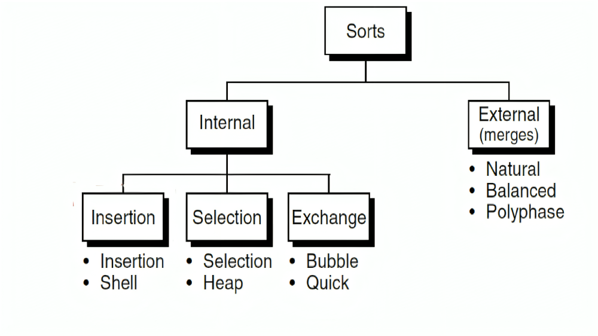

# Sorting-Algorithms

<div align = "center">

</div>

### Table of Contents

* [Internal](#internal-sorting-algorithms)
  * [Insertion](#insertion-sort-strategy)
    * [Insertion](#insertion-sort)
    * [Shell](#shell-sort)
  * [Selection](#selection-sort-strategy)
    * [Selection](#selection-sort)
    * [Heap](#heap-sort)
  * [Exchange](#exchange-sort-strategy)
    * [Bubble](#bubble-sort)
    * [Quick](#quick-sort)
* [External (merges)](#external-merges)
  * [Natural](#natural)
  * [Balanced](#balanced)
  * [Polyphase](#polyphase)
#
#
# Internal Sorting Algorithms

Internal sorting algorithms are techniques used to sort data that resides in the computer's main memory. These algorithms are designed to organize data efficiently within the memory space and are categorized based on their sorting strategies.

## Overview

Internal sorting algorithms sort data by directly accessing and manipulating elements in the computer's main memory. They are typically used when the entire dataset fits comfortably within memory, allowing for quick and efficient sorting operations. These algorithms are broadly classified into three main types:

## Insertion Sort Strategy

Insertion Sort algorithms build the sorted list one element at a time by inserting each new element into its correct position within the already sorted portion of the list. This category includes:
- **Insertion**: The classic Insertion Sort that builds the sorted list by repeatedly inserting elements into their correct position.
- **Shell**: An optimized version of Insertion Sort that reduces the gap between elements being compared, improving efficiency.

#
### Insertion Sort

Insertion Sort is a simple comparison-based sorting algorithm. It builds the final sorted array one item at a time. It is much less efficient on large lists than more advanced algorithms such as quicksort, heapsort, or merge sort.

#### Characteristics:
- **Time Complexity**: O(n²) for the worst and average cases, O(n) for the best case (when the list is already sorted).
- **Space Complexity**: O(1) because it only requires a constant amount of additional memory space.
- **Stability**: Stable.
- **In-Place**: Yes.

<div align = "center">

</div>


#### Example Code

##### Insertion Sort: Left to Right (Ascending Order)

```cpp
void insertionSort_asc_L2R(int arr[], int n) {
    int i, key, j;
    for (i = 1; i < n; i++) {
        key = arr[i];
        j = i - 1;
        while (j >= 0 && arr[j] > key) { // For ascending order
            arr[j + 1] = arr[j]; // Move elements greater than key to one position ahead of their current position
            j = j - 1;
        }
        arr[j + 1] = key;
    }
}
```

##### Insertion Sort: Right to Left (Ascending Order)

```cpp
void insertionSort_asc_R2L(int arr[], int n) {
    int i, key, j;
    for (i = n - 2; i >= 0; i--) { // Start from the second last element
        key = arr[i];
        j = i + 1;
        while (j < n && arr[j] < key) { // For ascending order
            arr[j - 1] = arr[j]; // Move elements greater than key to one position ahead of their current position
            j = j + 1;
        }
        arr[j - 1] = key;
    }
}
```

#### Explanation:

1. **Insertion Sort (Left to Right)**:
   - The algorithm iteratively takes an element from the unsorted portion and places it in the correct position in the sorted portion by shifting elements to the right.

2. **Insertion Sort (Right to Left)**:
   - This variation starts from the end of the array and iteratively takes an element from the unsorted portion, placing it in the correct position by shifting elements to the left.

#
#
### Shell Sort

Shell Sort is an optimization over Insertion Sort, where elements are sorted at a specific interval (gap) first and then the gap is reduced over time. This allows elements to be moved across the array more efficiently than in a standard insertion sort.

#### Characteristics:
- **Time Complexity**: Varies depending on the gap sequence, but typically between O(n^1.25) and O(n²).
- **Space Complexity**: O(1) because it only requires a constant amount of additional memory space.
- **Stability**: Not stable.
- **In-Place**: Yes.

<div align = "center">

</div>

#### Example Code

##### Shell Sort: Left to Right (Ascending Order)

```cpp
void ShellSort_asc_L2R(int arr[], int n) {
    // Start with a big gap, then reduce the gap
    for (int gap = n / 2; gap > 0; gap /= 2) {
        // Do a gapped insertion sort for this gap size.
        // The first gap elements a[0..gap-1] are already in gapped order
        // keep adding one more element until the entire array is gap sorted
        for (int i = gap; i < n; i++) {
            // add a[i] to the elements that have been gap sorted
            // save a[i] in temp and make a hole at position i
            int temp = arr[i];
            int j;
            // shift earlier gap-sorted elements up until the correct location for a[i] is found
            for (j = i; j >= gap && arr[j - gap] > temp; j -= gap) { // For ascending order
                arr[j] = arr[j - gap];
            }
            // put temp (the original a[i]) in its correct location
            arr[j] = temp;
        }
    }
}
```

##### Shell Sort: Right to Left (Ascending Order)

```cpp
void ShellSort_asc_R2L(int arr[], int n) {
    // Start with a big gap, then reduce the gap
    for (int gap = n / 2; gap > 0; gap /= 2) {
        // Do a gapped insertion sort for this gap size.
        // The first gap elements a[0..gap-1] are already in gapped order
        // keep adding one more element until the entire array is gap sorted
        for (int i = n - gap - 1; i >= 0; i--) {
            // add a[i] to the elements that have been gap sorted
            // save a[i] in temp and make a hole at position i
            int temp = arr[i];
            int j;
            // shift earlier gap-sorted elements up until the correct location for a[i] is found
            for (j = i; j < n - gap && arr[j + gap] < temp; j += gap) { // For ascending order
                arr[j] = arr[j + gap];
            }
            // put temp (the original a[i]) in its correct location
            arr[j] = temp;
        }
    }
}
```

#### Explanation:

1. **Shell Sort (Left to Right)**:
   - The algorithm starts with a large gap between elements, then reduces the gap after sorting the elements at that distance. The process continues until the gap is reduced to 1, at which point it becomes a standard insertion sort.

2. **Shell Sort (Right to Left)**:
   - This variation works similarly, but it starts from the end of the array and reduces the gap while sorting the elements from right to left.


#
#

## Selection Sort Strategy

Selection Sort algorithms work by repeatedly selecting the smallest (or largest) element from the unsorted portion and moving it to the sorted portion. This category includes:
- **Selection**: The basic Selection Sort that finds the minimum element and swaps it with the first unsorted element.
- **Heap**: A variant that uses a binary heap to improve the efficiency of finding the minimum element.
#
#
### Selection Sort

Selection Sort is a simple comparison-based sorting algorithm. The algorithm divides the input list into two parts: the sublist of items already sorted, which is built up from left to right at the front (or from right to left at the end), and the sublist of items remaining to be sorted.

#### Characteristics:
- **Time Complexity**: O(n²) for the best, worst, and average cases.
- **Space Complexity**: O(1) because it only requires a constant amount of additional memory space.
- **Stability**: Not stable.
- **In-Place**: Yes.

<div align = "center">

</div>

#### Example Code

##### Selection Sort: Left to Right (Ascending Order)

```cpp
void SelectionSort_asc_L2R(int arr[], int n) {
	for (int i = 0; i < n - 1; i++) {
		int min = i;  // Assume the minimum element is the first element
		for (int j = i + 1; j < n; j++) {
			if (arr[j] < arr[min]) {  // For ascending order
				min = j;  // Find the index of the minimum element
			}
		}
		if (min != i) {
			std::swap(arr[i], arr[min]);  // Swap the minimum element with the first element
		}
	}
}

```
##### Selection Sort: Right to Left (Descending Order)

```cpp
void SelectionSort_asc_R2L(int arr[], int n) {
	for (int i = n - 1; i > 0; i--) {
		int max = i;  // Assume the maximum element is the last element
		for (int j = i - 1; j >= 0; j--) {
			if (arr[j] > arr[max]) {  // For descending order
				max = j;  // Find the index of the maximum element
			}
		}
		if (max != i) {
			std::swap(arr[i], arr[max]);  // Swap the maximum element with the last element
		}
	}
}
```


#### Explanation:

1. **Selection Sort (Left to Right)**:
   - The algorithm searches for the minimum element in the array and swaps it with the first unsorted element, building a sorted list from left to right.

2. **Selection Sort (Right to Left)**:
   - This version works in reverse, searching for the maximum element and swapping it with the last unsorted element, building a sorted list from right to left.
#
#
### Heap Sort

Heap Sort is a comparison-based sorting algorithm that utilizes a binary heap data structure. It can be used to sort elements in either ascending or descending order.

#### Characteristics:
- **Time Complexity**: O(n log n) for best, worst, and average cases.
- **Space Complexity**: O(1) because it only requires a constant amount of additional memory space.
- **Stability**: Not stable.
- **In-Place**: Yes.

<div align = "center">

</div>

#### Example Code

##### Heap Sort: Ascending Order (Right to Left)

```cpp
void Heapify_Max(int arr[], int n, int i) {
    int largest = i;
    int left = 2 * i + 1;
    int right = 2 * i + 2;
    if (left < n && arr[left] > arr[largest])
        largest = left;
    if (right < n && arr[right] > arr[largest])
        largest = right;
    if (largest != i) {
        std::swap(arr[i], arr[largest]);
        Heapify_Max(arr, n, largest);
    }
}

void HeapSort_asc_R2L(int arr[], int n) {
    // Build max heap
    for (int i = n / 2 - 1; i >= 0; i--)
        Heapify_Max(arr, n, i);
    
    // Extract elements from heap one by one
    for (int i = n - 1; i > 0; i--) {
        std::swap(arr[0], arr[i]); // Move current root to end
        Heapify_Max(arr, i, 0); // Call max heapify on the reduced heap
    }
}
```
##### Heap Sort: Descending Order (Left to Right)

```cpp
void Heapify_Min(int arr[], int n, int i) {
    int smallest = i;
    int left = 2 * i + 1;
    int right = 2 * i + 2;
    if (left < n && arr[left] < arr[smallest])
        smallest = left;
    if (right < n && arr[right] < arr[smallest])
        smallest = right;
    if (smallest != i) {
        std::swap(arr[i], arr[smallest]);
        Heapify_Min(arr, n, smallest);
    }
}

void HeapSort_desc_L2R(int arr[], int n) {
    // Build min heap
    for (int i = n / 2 - 1; i >= 0; i--)
        Heapify_Min(arr, n, i);
    
    // Extract elements from heap one by one
    for (int i = n - 1; i > 0; i--) {
        std::swap(arr[0], arr[i]); // Move current root to end
        Heapify_Min(arr, i, 0); // Call min heapify on the reduced heap
    }
}

```
#### Explanation:

1. **Heap Sort (Ascending Order - Right to Left)**:
   - **Build Max Heap**: The algorithm first converts the array into a max heap. A max heap is a binary tree where the value of each node is greater than or equal to the values of its children.
   - **Sort**: The largest element (root of the max heap) is swapped with the last element of the array. The heap size is reduced, and the heap property is restored for the remaining elements. This process is repeated until the entire array is sorted in ascending order.

2. **Heap Sort (Descending Order - Left to Right)**:
   - **Build Min Heap**: This time, the array is converted into a min heap, where the value of each node is less than or equal to the values of its children.
   - **Sort**: The smallest element (root of the min heap) is swapped with the last element of the array. The heap size is reduced, and the heap property is restored for the remaining elements. This process is repeated until the entire array is sorted in descending order.

#
#

## Exchange Sort Strategy

Exchange Sort algorithms sort data by repeatedly exchanging elements to achieve the desired order. This category includes:
- **Bubble**: An elementary Exchange Sort that repeatedly steps through the list, compares adjacent elements, and swaps them if necessary.
- **Quick**: A more advanced Exchange Sort that uses a divide-and-conquer approach, partitioning the list around a pivot to sort the elements efficiently.

Each of these types of internal sorting algorithms has its own strengths and weaknesses, making them suitable for different scenarios based on the size of the dataset and performance requirements.
#
#
### Bubble Sort

Bubble Sort is a simple comparison-based sorting algorithm. It repeatedly steps through the list, compares adjacent elements, and swaps them if they are in the wrong order. This process is repeated until the list is sorted.

#### Characteristics:
- **Time Complexity**: O(n²) for the worst and average cases, O(n) for the best case (when the list is already sorted).
- **Space Complexity**: O(1) because it only requires a constant amount of additional memory space.
- **Stability**: Stable.
- **In-Place**: Yes.

<div align = "center">

</div>

#### Example Code

##### Bubble Sort: Left to Right (Ascending Order)

```cpp
void BubbleSort_asc_R2L(int arr[], int n) {
    for (int i = 0; i < n - 1; i++) {
        for (int j = 0; j < n - i - 1; j++) {
            if (arr[j] > arr[j + 1]) { // For ascending order
                std::swap(arr[j], arr[j + 1]);
            }
        }
    }
}
```
##### Bubble Sort: Right to Left (Ascending Order)

```cpp
void BubbleSort_asc_L2R(int arr[], int n) {
    for (int i = n - 1; i > 0; i--) {
        for (int j = n - 1; j > n - i - 1; j--) {
            if (arr[j] < arr[j - 1]) { // For ascending order
                std::swap(arr[j], arr[j - 1]);
            }
        }
    }
}
```

#### Explanation:

1. **Bubble Sort (Left to Right)**:
   - The algorithm works by repeatedly swapping adjacent elements if they are in the wrong order, with the largest unsorted element "bubbling" to the top of the list with each pass.

2. **Bubble Sort (Right to Left)**:
   - In this variation, the algorithm compares elements from the end of the array, with the smallest unsorted element "bubbling" to the bottom of the list with each pass.
#
#
### Quick Sort

Quick Sort is a comparison-based sorting algorithm that uses a divide-and-conquer approach. It efficiently sorts elements by partitioning the array into subarrays and then recursively sorting the subarrays.

#### Characteristics:
- **Time Complexity**: O(n log n) on average; O(n²) in the worst case.
- **Space Complexity**: O(log n) due to the stack space used by recursion.
- **Stability**: Not stable.
- **In-Place**: Yes.

<div align = "center">

</div>

#### Example Code

##### Quick Sort: Ascending Order (Right to Left)

```cpp
int partition(int arr[], int low, int high) {
    // select the rightmost element as pivot
    int pivot = arr[high];
    int i = (low - 1);

    // traverse each element of the array and compare them with the pivot
    for (int j = low; j < high; j++) {
        if (arr[j] <= pivot) { // For ascending order
            i++;
            std::swap(arr[i], arr[j]);
        }
    }

    // swap pivot with the element at i + 1
    std::swap(arr[i + 1], arr[high]);

    // return the partition point
    return (i + 1);
}

void QuickSort_asc_R2L(int arr[], int low, int high) {
    if (low < high) {
        int pi = partition(arr, low, high); // partition the array

        // recursive call on the left and right of pivot
        QuickSort_asc_R2L(arr, low, pi - 1);
        QuickSort_asc_R2L(arr, pi + 1, high);
    }
}
```
##### Quick Sort: Descending Order (Left to Right)

```cpp
int partition(int arr[], int low, int high) {
    // select the rightmost element as pivot
    int pivot = arr[high];
    int i = (low - 1);

    // traverse each element of the array and compare them with the pivot
    for (int j = low; j < high; j++) {
        if (arr[j] >= pivot) { // For descending order
            i++;
            std::swap(arr[i], arr[j]);
        }
    }

    // swap pivot with the element at i + 1
    std::swap(arr[i + 1], arr[high]);

    // return the partition point
    return (i + 1);
}

void QuickSort_desc_L2R(int arr[], int low, int high) {
    if (low < high) {
        int pi = partition(arr, low, high); // partition the array

        // recursive call on the right and left of pivot
        QuickSort_desc_L2R(arr, pi + 1, high);
        QuickSort_desc_L2R(arr, low, pi - 1);
    }
}

```
#### Explanation:

1. **Quick Sort (Ascending Order - Right to Left)**:
   - **Partition**: The array is partitioned around a pivot element. Elements smaller than the pivot are moved to the left of the pivot, and elements greater than the pivot are moved to the right.
   - **Sort**: The algorithm recursively applies the same process to the subarrays on the left and right of the pivot until the entire array is sorted in ascending order.

2. **Quick Sort (Descending Order - Left to Right)**:
   - **Partition**: The array is partitioned around a pivot element. Elements greater than the pivot are moved to the left of the pivot, and elements smaller than the pivot are moved to the right.
   - **Sort**: The algorithm recursively applies the same process to the subarrays on the left and right of the pivot until the entire array is sorted in descending order.
#
#


# External Sorting Algorithms

External sorting algorithms are techniques used to sort data that cannot fit entirely into the computer's main memory. They are designed to handle large datasets by efficiently managing the data that resides on external storage, such as disk drives. These algorithms are essential for processing and sorting large volumes of data in scenarios where memory limitations make it impractical to use internal sorting methods.

## Overview

External sorting algorithms work by dividing the large dataset into smaller chunks that can be processed in memory and then merging these chunks to produce the final sorted output. They are particularly useful when dealing with data that exceeds the available main memory, allowing for efficient sorting operations by leveraging external storage. The primary types of external sorting algorithms include:

- **Natural Merge Sort**: This algorithm merges runs of sorted data into larger runs until the entire dataset is sorted. It takes advantage of already sorted portions of the data to minimize the amount of merging required.

- **Balanced Merge Sort**: This approach uses a balanced number of runs and merges them in a manner that maintains a balance between merging cost and I/O operations, ensuring efficient use of resources.

- **Polyphase Merge Sort**: This algorithm optimizes the merging process by using multiple merge passes with a polyphase distribution of runs, reducing the number of I/O operations and improving efficiency for very large datasets.

Each of these external sorting algorithms is tailored to handle different scenarios and constraints associated with sorting data that cannot fit entirely in memory.

### Merge Sort

Merge Sort is a comparison-based sorting algorithm that follows the divide-and-conquer strategy. It recursively divides the array into smaller subarrays, sorts them, and then merges them back together.

#### Characteristics:
- **Time Complexity**: O(n log n) for best, worst, and average cases.
- **Space Complexity**: O(n) due to the temporary arrays used for merging.
- **Stability**: Stable.
- **In-Place**: No (uses additional space for merging).

<div align = "center">

</div>

#### Example Code

##### Merge Sort: Ascending Order (Left to Right)

```cpp
void Merge(int arr[], int l, int m, int r) {
    int n1 = m - l + 1; // size of the first subarray
    int n2 = r - m; // size of the second subarray

    // create temp arrays
    int* L = new int[n1];
    int* R = new int[n2];

    // Copy data to temp arrays L[] and R[]
    for (int i = 0; i < n1; i++)
        L[i] = arr[l + i];
    for (int j = 0; j < n2; j++)
        R[j] = arr[m + 1 + j];

    // Merge the temp arrays back into arr[l..r]
    int i = 0; // Initial index of first subarray
    int j = 0; // Initial index of second subarray
    int k = l; // Initial index of merged subarray

    // Merge the temp arrays while comparing the elements
    while (i < n1 && j < n2) {
        if (L[i] <= R[j]) { // For ascending order
            arr[k] = L[i];
            i++;
        }
        else {
            arr[k] = R[j];
            j++;
        }
        k++;
    }

    // Copy the remaining elements of L[], if there are any
    while (i < n1) {
        arr[k] = L[i];
        i++;
        k++;
    }

    // Copy the remaining elements of R[], if there are any
    while (j < n2) {
        arr[k] = R[j];
        j++;
        k++;
    }

    // Deallocate the memory
    delete[] L;
    delete[] R;
}

void Merge_asc_L2R(int arr[], int l, int r) {
    if (l < r) {
        int m = l + (r - l) / 2; // Same as (l+r)/2, but avoids overflow

        // Sort first and second halves
        Merge_asc_L2R(arr, l, m);
        Merge_asc_L2R(arr, m + 1, r);

        // Merge the sorted halves
        Merge(arr, l, m, r);
    }
}
```
##### Merge Sort: Ascending Order (Right to Left)

```cpp
void Merge_asc_R2L(int arr[], int l, int r) {
    if (l < r) {
        int m = l + (r - l) / 2; // Same as (l+r)/2, but avoids overflow

        // Sort first and second halves in reverse order
        Merge_asc_R2L(arr, m + 1, r);
        Merge_asc_R2L(arr, l, m);

        // Merge the sorted halves
        Merge(arr, l, m, r);
    }
}
```
#### Explanation:

1. **Merge Sort (Ascending Order - Left to Right)**:
   - **Merge**: The function merges two sorted subarrays back into a single sorted array. It uses temporary arrays to hold the two subarrays and then merges them by comparing elements.
   - **Sort**: The array is recursively divided into two halves until each subarray contains a single element or is empty. The subarrays are then merged in a sorted manner.

2. **Merge Sort (Ascending Order - Right to Left)**:
   - **Merge**: Similar to the left-to-right approach, but the halves are sorted in reverse order before merging. This results in a sorted array when merged.
   - **Sort**: The recursion first sorts the right half, then the left half, and finally merges them. This approach achieves the same result but starts merging from the rightmost subarray.
#
#

## Sorting Algorithms Comparison

This table provides a comprehensive comparison of various sorting algorithms, including their time complexity, space complexity, stability, and in-place nature.

| Name      | Best     | Average  | Worst   | Memory | Stable | In-Place |
|-----------|----------|----------|----------|--------|--------|----------|
| Insertion Sort | <span style="color:green;">n</span>  | <span style="color:red;">n<sup>2</sup></span>  | <span style="color:red;">n<sup>2</sup></span>  | <span style="color:green;">1</span>      | <span style="color:green;">Yes</span>   | <span style="color:green;">Yes</span>       |
| Shell Sort | <span style="color:green;">n log n</span>  | <span style="color:yellow;">n<sup>1.25</sup></span>  | <span style="color:yellow;">n<sup>1.5</sup></span>  | <span style="color:green;">1</span>      | <span style="color:red;">No</span>   | <span style="color:green;">Yes</span>       |
| Selection Sort | <span style="color:red;">n<sup>2</sup></span>  | <span style="color:red;">n<sup>2</sup></span>  | <span style="color:red;">n<sup>2</sup></span>  | <span style="color:green;">1</span>      | <span style="color:red;">No</span>   | <span style="color:green;">Yes</span>       |
| Heap Sort | <span style="color:green;">n log n</span>  | <span style="color:green;">n log n</span>  | <span style="color:green;">n log n</span>  | <span style="color:green;">1</span>      | <span style="color:red;">No</span>   | <span style="color:green;">Yes</span>      |
| Bubble Sort | <span style="color:green;">n</span>  | <span style="color:red;">n<sup>2</sup></span>  | <span style="color:red;">n<sup>2</sup></span>  | <span style="color:green;">1</span>      | <span style="color:green;">Yes</span>   | <span style="color:green;">Yes</span>       |
| Quick Sort | <span style="color:green;">n log n</span>  | <span style="color:green;">n log n</span>  | <span style="color:red;">n<sup>2</sup></span>  | <span style="color:yellow;">log n</span>      | <span style="color:red;">No</span>   | <span style="color:green;">Yes</span>       |
| Merge Sort | <span style="color:green;">n log n</span>  | <span style="color:green;">n log n</span>  | <span style="color:green;">n log n</span>  | <span style="color:red;">n</span>      | <span style="color:green;">Yes</span>   | <span style="color:red;">No</span>       |
#

**To visualize these algorithms in action, check out the following interactive tools:**

* **HackerEarth:** https://www.hackerearth.com/practice/algorithms/sorting/bubble-sort/visualize/

#
#
## Useful articles
- [ Sorting algorithm - Wikipedia](https://en.wikipedia.org/wiki/Sorting_algorithm)
- [Programiz](https://www.programiz.com/dsa/sorting-algorithm)
- [Sorting Algorithms - GeeksforGeeks](https://www.geeksforgeeks.org/sorting-algorithms/)

## For practice

- [Coding Interview Questions | TakeUforward](https://takeuforward.org/interviews/strivers-sde-sheet-top-coding-interview-problems/)


